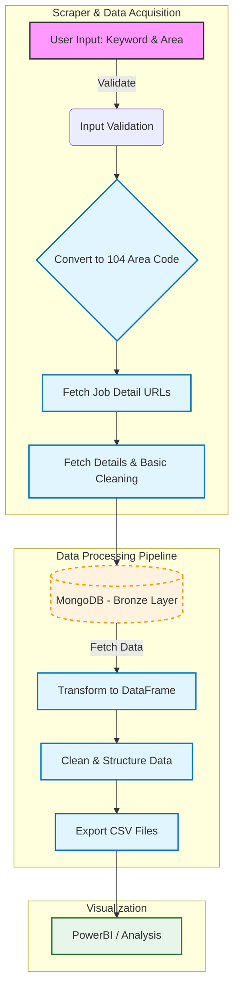

# Taiwan Job Market Analysis

A comprehensive tool to analyze the job market in Taiwan by crawling data from the 104 Job Bank, storing it in a MongoDB database, and processing it for visualization.

## Features

- **Data Collection**: Crawl job details (skills, salary, requirements) from 104 Job Bank based on keywords and areas.
- **Data Storage**: Store raw and processed data in MongoDB Atlas (Bronze Layer).
- **Data Cleaning**: Classify job titles, normalize skills, and process salary information (monthly/annual conversion).
- **Data Export**: Export processed data to CSV files for visualization in tools like PowerBI.
- **CLI Interface**: Easy-to-use command-line interface for all operations.

## Tech Stack

- **Language**: Python 3.13+
- **Package Manager**: [uv](https://github.com/astral-sh/uv)
- **Database**: MongoDB Atlas
- **Libraries**:
  - `pandas`: Data manipulation
  - `pymongo`: MongoDB interaction
  - `requests`: HTTP requests
  - `click`: CLI creation

## Prerequisites

- Python 3.13 or higher
- [uv](https://github.com/astral-sh/uv) installed
- MongoDB Atlas account and cluster

## Installation

1. **Clone the repository**

   ```bash
   git clone <repository-url>
   cd Taiwan_Job_Market_Analysis
   ```

2. **Install dependencies**

   ```bash
   uv sync
   ```

## Configuration

1. Create a `.env` file in the root directory.
2. Add your MongoDB Atlas credentials:

   ```env
   MONGO_HOST=your-cluster-url.mongodb.net
   CLUSTER=your-cluster-name
   DB_USER=your-username
   DB_PASSWORD=your-password
   ```

   > **Note**: Ensure your IP address is whitelisted in your MongoDB Atlas Network Access settings.

## Usage

Run the tool using `uv run python main.py`.

### 1. Fetch Data

Crawl job data and save it to the database.

```bash
uv run python main.py fetch -k "Python" -a "台北市"
```

- `-k`, `--keyword`: Search keyword (e.g., "Python", "Data Engineer").
- `-a`, `--area`: Search area (default: "台北市").

### 2. Export Data

Select data from the database and export it to CSV files in the `result/` directory.

```bash
uv run python main.py export -f "python_jobs" -r "Python"
```

- `-f`, `--filename`: Prefix for the output CSV files.
- `-r`, `--regex`: (Optional) Regex to filter job names.

### 3. Run All

Execute the complete workflow: Fetch -> Save -> Export.

```bash
uv run python main.py run_all -k "Data Scientist" -a "新北市" -f "ds_jobs"
```

## Project Structure

```text
.
├── config/             # Configuration files (logging)
|   └── config_log.py      # Configuration settings
├── services/           # Core logic
│   ├── crawler.py      # 104 Job Bank crawler
│   ├── db.py           # MongoDB operations
│   ├── cleaner.py      # Data cleaning and transformation
│   ├── LLM.py          # LLM integration
|   └── ...
├── main.py             # CLI entry point
├── pyproject.toml      # Project dependencies
└── README.md           # Project documentation
```

## Workflow


