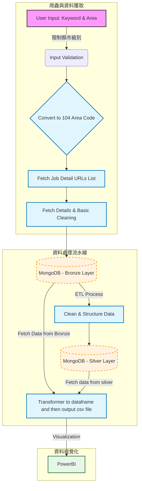

# Taiwan job market analysis

## Description

This project is to analyze the job market in Taiwan. The data is from 104 job bank. The project is divided into three parts: data collection, data analysis and data visualization.

## Use tech

- Python
- MongoDB Atlas (cloud)
- uv

## Hint

要先去 MongoDB Atlas 將 IP 加入指定 cluster 的白名單

## Flow chart

```mermaid
graph TD
    %% 定義樣式
    classDef input fill:#f9f,stroke:#333,stroke-width:2px;
    classDef process fill:#e1f5fe,stroke:#0277bd,stroke-width:2px;
    classDef db fill:#fff3e0,stroke:#ff9800,stroke-width:2px,stroke-dasharray: 5 5;
    classDef chart fill:#e8f5e9,stroke:#2e7d32,stroke-width:2px;

    %% 模組 1: 使用者輸入與爬蟲
    subgraph Scraper_System [爬蟲與資料獲取]
        A[User Input: Keyword & Area]:::input -->|限制縣市級別| B(Input Validation)
        B --> C{Convert to 104 Area Code}:::process
        C --> D[Fetch Job Detail URLs List]:::process
        D --> E[Fetch Details & Basic Cleaning]:::process
    end

    %% 模組 2: 原始資料層 (Bronze)
    E --> F[(MongoDB - Bronze Layer)]:::db

    %% 模組 3: 資料處理與分流
    subgraph Data_Pipeline [資料處理流水線]
        F -->|Fetch Data from Bronze| J[Transformer to dataframe and then output csv file]:::process
        F -->|ETL Process| H[Clean & Structure Data]:::process
        H --> I[(MongoDB - Silver Layer)]:::db
    end

    %% 模組 4: 精煉資料應用
    subgraph Visualization [資料視覺化]
        I -->|Fetch data from silver| J[Transformer to dataframe and then output csv file]:::process
        J --> |Visualization| K[PowerBI]:::chart
    end
```

## Reference

[https://www.104.com.tw/]
