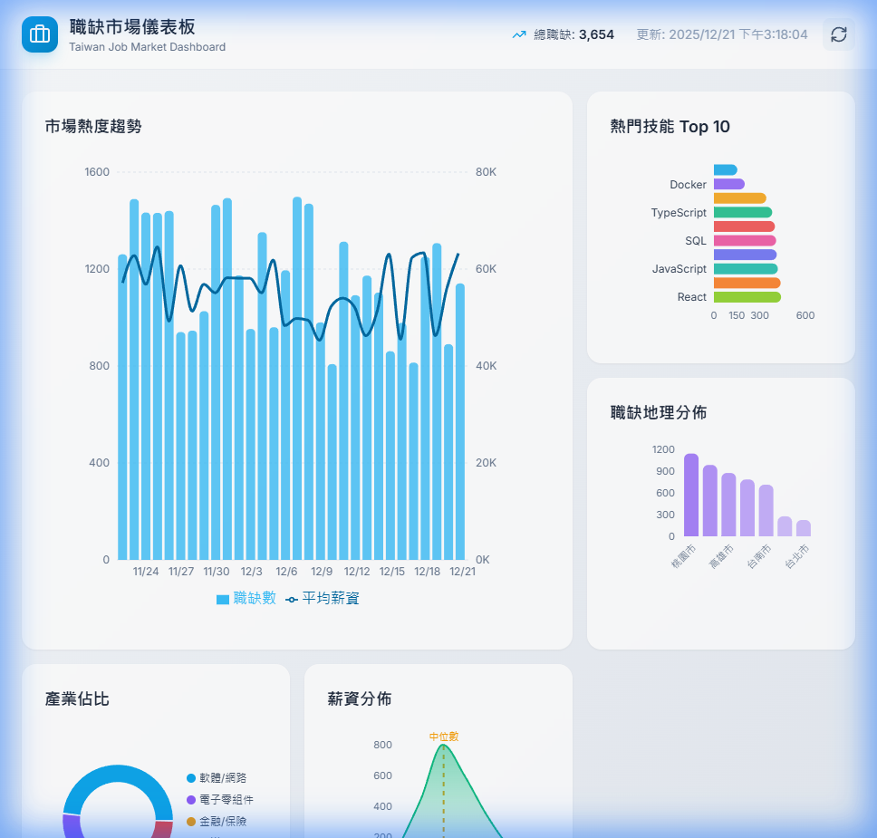
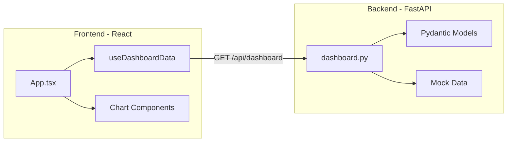

# Job Market Dashboard - Implementation Walkthrough

## Result

The full-stack Job Market Dashboard is now running:

- **Backend API**: http://127.0.0.1:8080
- **Frontend Dashboard**: http://localhost:5173



---

## Architecture Summary



---

## Key Files Created

### Backend (`services/web_server/`)

| File                                                                       | Description                                 |
| -------------------------------------------------------------------------- | ------------------------------------------- |
| [pyproject.toml](./services/web_server/pyproject.toml)                     | Dependencies: FastAPI, Pydantic, SQLAlchemy |
| [src/main.py](./services/web_server/src/main.py)                           | FastAPI app with CORS, routers              |
| [src/models/dashboard.py](./services/web_server/src/models/dashboard.py)   | Pydantic models (data contract)             |
| [src/routers/dashboard.py](./services/web_server/src/routers/dashboard.py) | `/api/dashboard` endpoint with mock data    |
| [src/db/repository.py](./services/web_server/src/db/repository.py)         | MySQL queries (ready for real data)         |

---

### Frontend (`frontend/`)

| File                                                                      | Description                          |
| ------------------------------------------------------------------------- | ------------------------------------ |
| [package.json](./frontend/package.json)                                   | Vite + React + TypeScript + Tailwind |
| [tsconfig.json](./frontend/tsconfig.json)                                 | Strict mode enabled                  |
| [src/types/market.ts](./frontend/src/types/market.ts)                     | TypeScript interfaces                |
| [src/config/dashboardConfig.ts](./frontend/src/config/dashboardConfig.ts) | Config-driven layout                 |
| [src/App.tsx](./frontend/src/App.tsx)                                     | Main dashboard component             |

---

## Chart Components

| Chart      | File                                                                        | Type              |
| ---------- | --------------------------------------------------------------------------- | ----------------- |
| Hero Trend | [TrendChart.tsx](./frontend/src/components/charts/TrendChart.tsx)           | Composed Line+Bar |
| Top Skills | [SkillsChart.tsx](./frontend/src/components/charts/SkillsChart.tsx)         | Horizontal Bar    |
| Regions    | [RegionsChart.tsx](./frontend/src/components/charts/RegionsChart.tsx)       | Bar (intensity)   |
| Industries | [IndustryChart.tsx](./frontend/src/components/charts/IndustryChart.tsx)     | Donut             |
| Salary     | [SalaryDistChart.tsx](./frontend/src/components/charts/SalaryDistChart.tsx) | Area (median)     |

---

## Running the System

### Start Backend

```bash
cd services/web_server
uv run uvicorn src.main:app --port 8080 --reload
```

### Start Frontend

```bash
cd frontend
npm run dev
```

---

## Next Steps (Optional)

1. **Connect to Real Database**: Modify `src/routers/dashboard.py` to use `DatabaseRepository` instead of mock data
2. **Add ViewSwitcher**: Implement different dashboard views (Macro/Micro)
3. **Docker Integration**: Add frontend to `docker-compose.yml`
